# Andrea Torti

I obtained my Master's Degree in Computer Science and Engineering @ Politecnico di Milano in 2025 and I specialized in low-level programming and optimization, with some computer graphics, computer vision, robotics, embedded development and AI sprinkled here and there. I even wrote a lot of raw CUDA code and obtained a couple certifications from Nvidia!

During my academic career, I loved hands-on projects the most, where I could have control over every piece of the software I was developing and take pride in the results. Most of them were group projects, and that's where I discovered that I perform the best working with a team on tough problems and under strict deadlines. Some were developed on Windows, most on Linux, but I also daily macOS.

Here's a preview of some of my work, but there's always something more that's work in progress... always building, always learning!

**CFD Software written from scratch entirely in C++! Can run on CPU (Even in parallel with OpenMP) or on your NVIDIA GPU!**

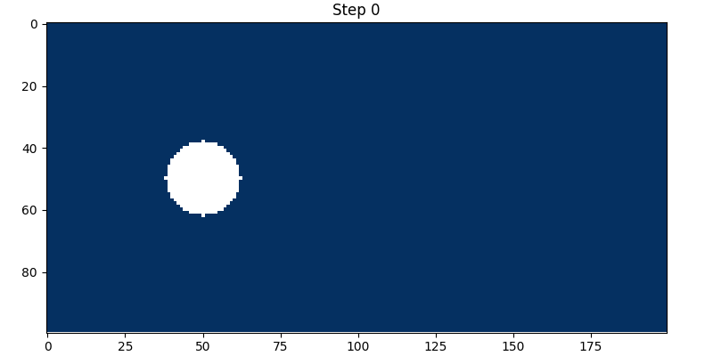

**On GPU, performance was the top priority, so I chose the structure of arrays approach. On CPU, arrays of structures is used for better code readability.**

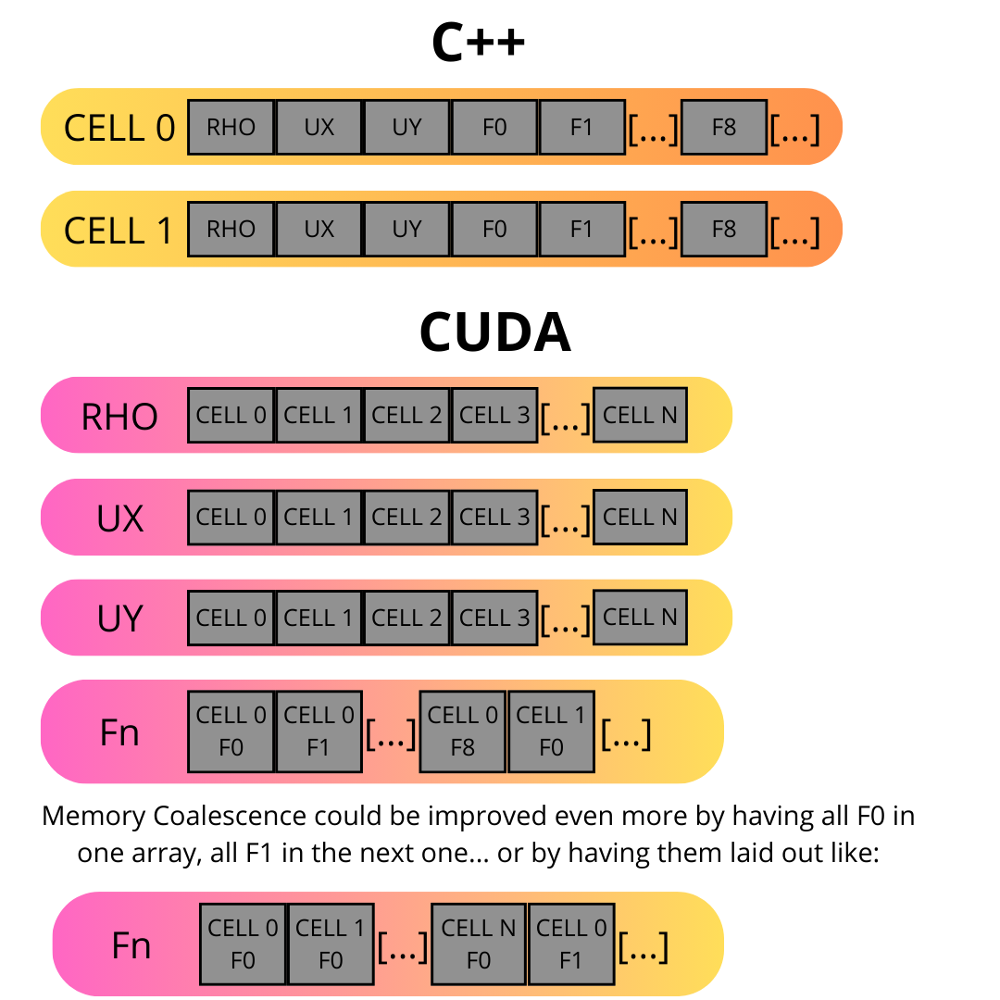

**Yes, the performance was profiled with callgrind. Down to the single function call.**

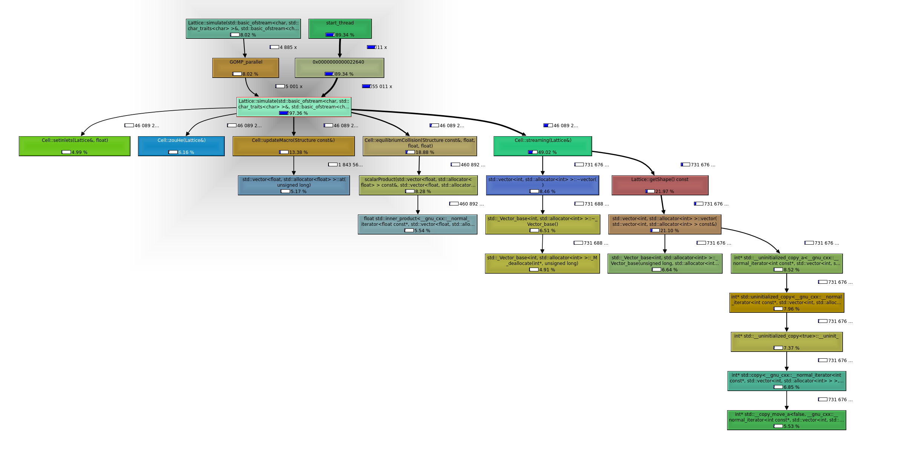

**Did you think I wouldn't profile the GPU too?**

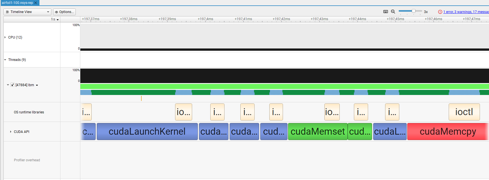

---

**Onto the next one. My master thesis, actually. Have you ever eaten instant noodles? Well, sometimes their packaging is not perfectly sealed...**

**Having only about a hundred or so profilometer scans, I had to make the computer do its magic to split the good ones from the bad ones. The obvious solution is machine learning, but it's not easy at all with a low sample count like that. I chose to pre-train my model on synthetic data generated with blender on packages like the one below:**

**After proper automatic pre-processing of each package profile...**

**The accuracy went to 89% with very good spot detection of defects! Mission accomplished!**

---

**Another one! The data you see is from an Arduino's motion sensors.**

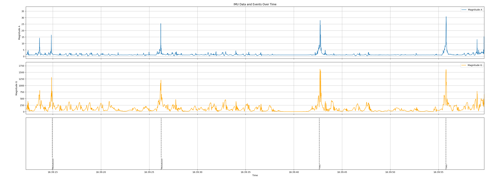

**My friend chatgpt wrote some python software to cut 1-second samples...**

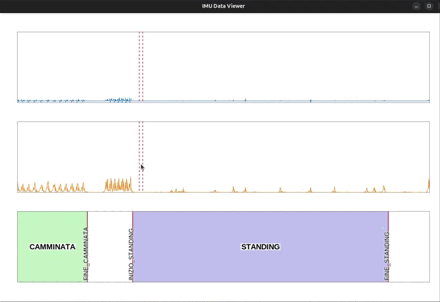

**And I trained a tensorflow deep learning model to recognize what the person wearing the arduino was doing! How cool is that? Oh and it runs ON the actual arduino!**

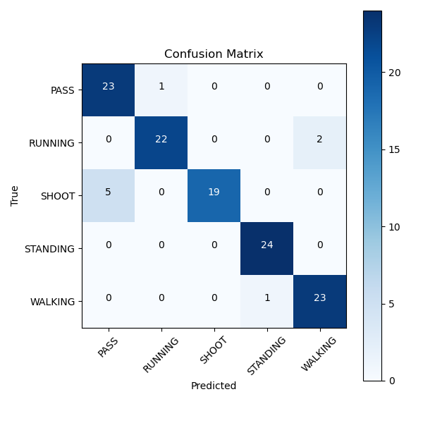

---

**Do you like trading? Here's a little trading game for you! Done over a weekend, needs some polish. At least it works (sometimes)**

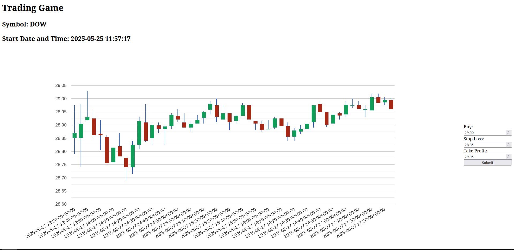

---

**Oh yeah I took a Vulkan course at university. Here's a little game running on an engine... written from scratch.**

---

**Here you go: two static websites I made. First one: modern framework, about modern C++. Right in your face.**

[Github Pages Link](https://andreatorti-01.github.io/Cplusplus-intermediate-guide/)

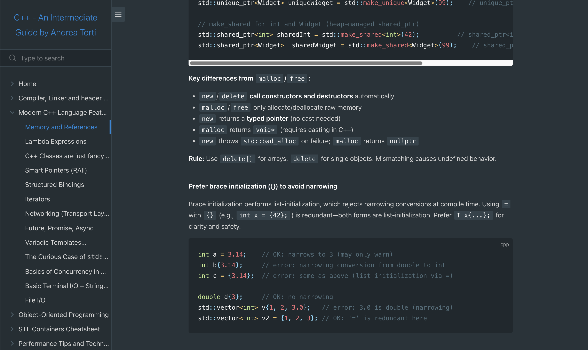

**Second one with some personal recipes. VanillaJS technology. Yes I even like cooking! And yes you can read it too since it's bilingual. Now that I think about it I should do a travel blog too...**

[Netlify Link](https://burro-recipes.netlify.app/index-en)

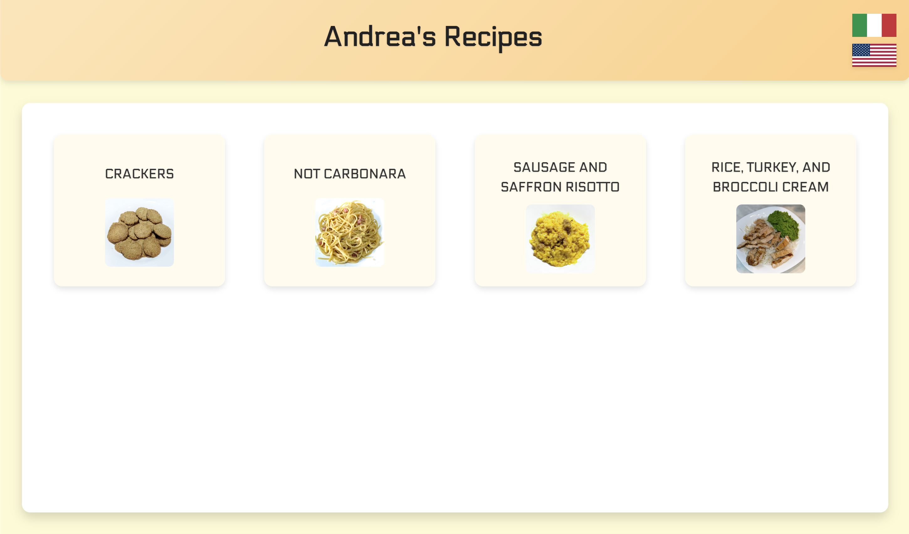

---

**Here goes the first thing I ever wrote in CUDA: Took an existing software that compresses molecule data (Smiles representation) and made it run on the GPU... 44 times faster! Oh and that's only because the disk couldn't keep up!**

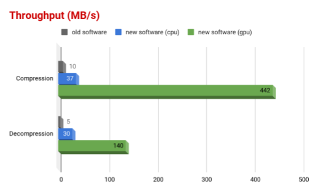
